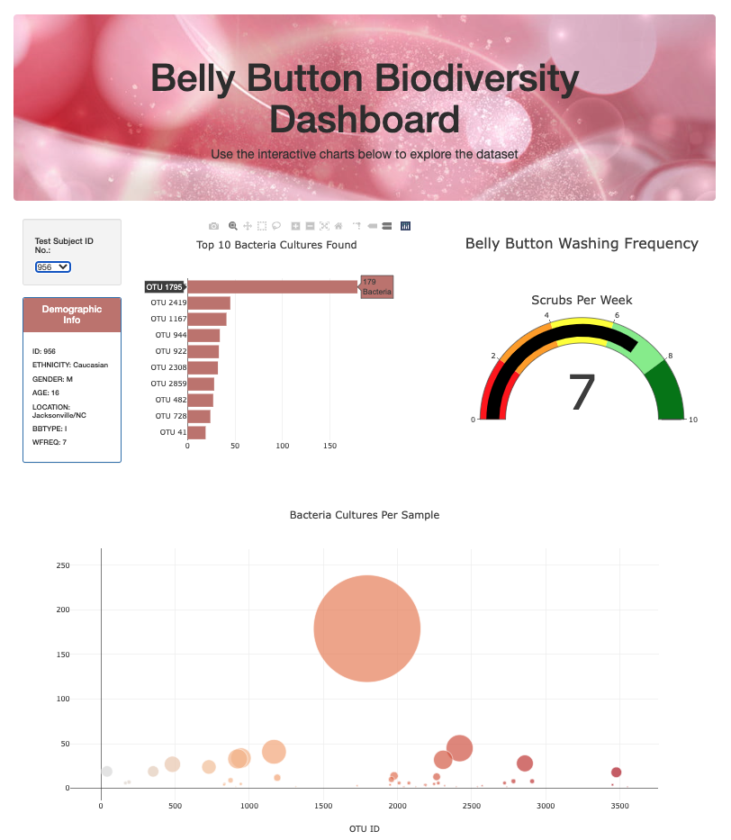
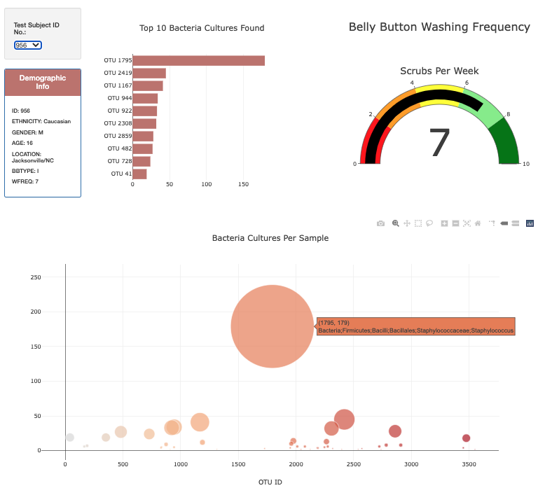

# Belly_Button_Biodiversity

## Project Overview

- In this project, we are using plotly and javascript for data visulizations. Here we have a research to analyze the bacteria culture of people's belly buttons. We create this page to enable each person to choose their IDs and find out their belly button bacteria situations. 

## Link to the Interactive Webpage : 
https://biboking.github.io/Belly_Button_Biodiversity/

## Explaining of the Charts
-The Horizontal Bar Chart shows the top 10 bacteria sample IDs found in each subject and their values. When th mouse hover on a specific bar, it will show the names of the sample ID.
- The guage on the top right shows how often a subject needs to clean his belly button.
- The bubble chart on the bottom is a glance of the overall bacteria sample culture of each subject. Hovering on it will also show the sample labels.

#### The webpage when hoving on the bar-chart

#### The webpage when hoving on the bubble-chart

